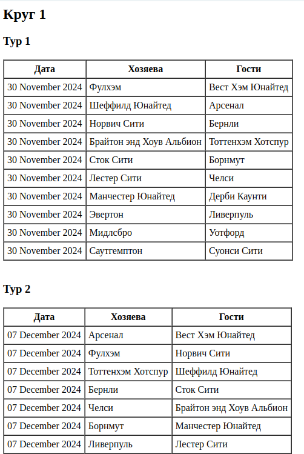

## Генерация календаря футбольного чемпионата

### Описание

Этот проект представляет собой скрипт на PHP, который генерирует календарь чемпионата на один сезон 
для футбольных команд. Каждая команда играет с каждой другой по два раза: один матч дома и один в гостях.

### Входные данные

Скрипт принимает на вход JSON (переменной, файлом или по ссылке), содержащий список команд.

### Технологии

PHP версии 7.4

### Вывод календаря

Результат сформированного футбольного календаря выводится в виде таблиц, показывающих два круга и разбивку на туры 
внутри каждого круга.

### Скриншот календаря

